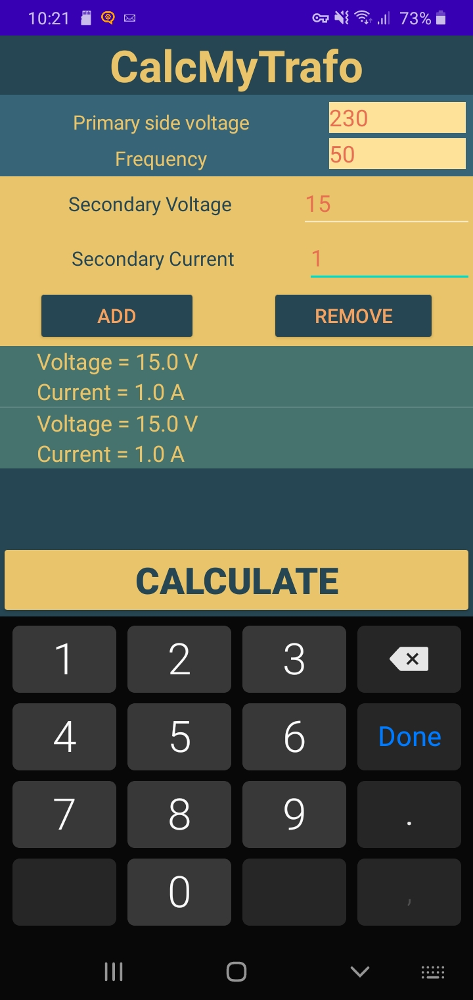
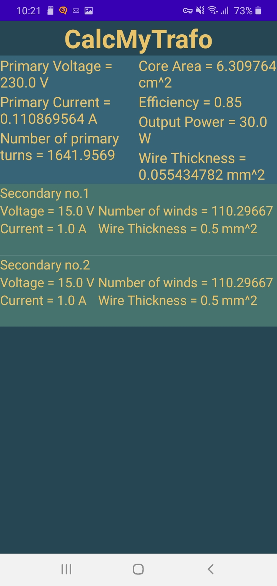

CalcMyTrafo
---

zadatak iz kolegija osnove razvoja web i mobilnih aplikacija

za dani napon i frekvenciju primara i tražene napone i struje sekundara, računaju se svi potrebni parametri za izradu transformatora

Programirano u Javi u android studio razvojnom okruženju.

---
slike
-

